<div align="center">

# 🌱 CarbonLoop

### Turn captured CO₂ from a cost centre into a tradeable resource.

**A verified industrial marketplace where captured carbon finds its next use — matched, traded, transported and transformed.**

[](https://angular.dev)
[](https://spring.io)
[](https://openjdk.org)
[](https://postgresql.org)

[](#-how-the-matching-actually-works)
[](#-how-the-matching-actually-works)
[](#-how-the-matching-actually-works)
[](#-testing)

**Hackout '26 · DA-IICT · Theme: Circular Carbon Ecosystem**

</div>

---

## 🔥 The problem

Cement, steel and power plants capture CO₂ and then have nowhere to put it. Meanwhile fuel-synthesis plants, concrete producers, greenhouses and algae farms **buy** CO₂ as a raw input. The two sides cannot find each other, cannot agree a price, and cannot prove the gas is what the seller claims.

> If cement were a country, it would be the third-largest CO₂ emitter on Earth — behind only China and the United States.

**CarbonLoop closes that loop.** Emitters publish a verified CO₂ Passport, utilizers discover and bid on it, carriers move it, an independent lab certifies it, and a regulator watches the whole market.

---

## 🎬 See it

<div align="center">

### The marketplace, open to anyone
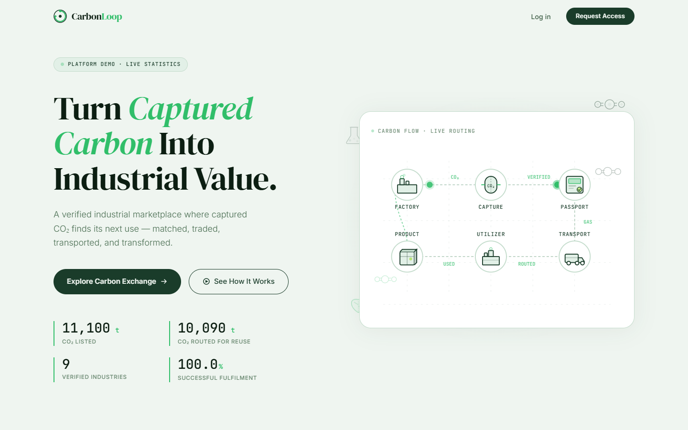

</div>

<table>
<tr>
<td width="50%">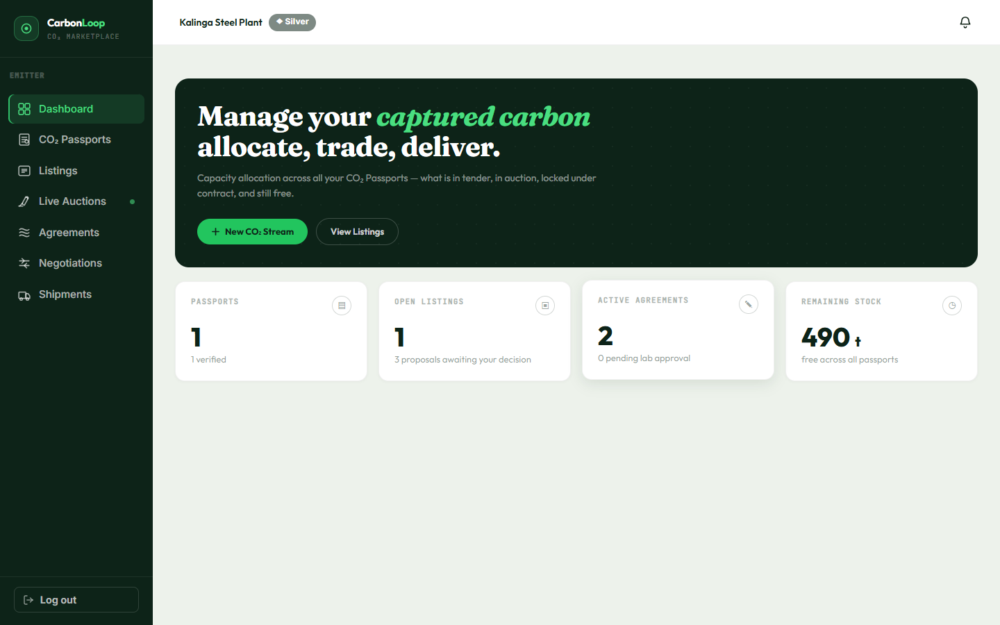<br/><b>Emitter dashboard</b><br/>Every tonne allocated across tender, auction, contract and free stock.</td>
<td width="50%">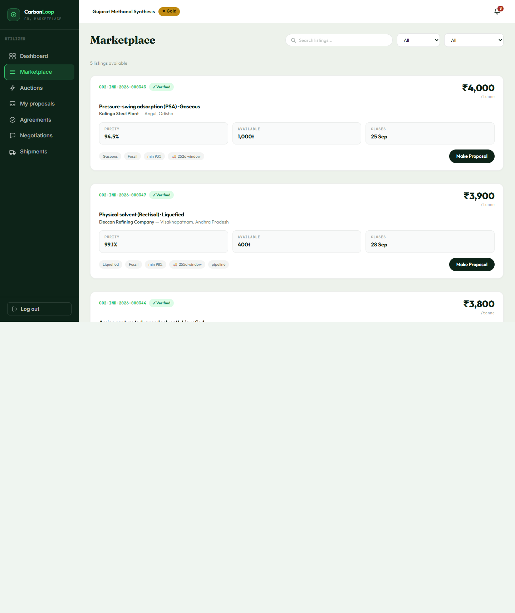<br/><b>Marketplace</b><br/>Verified supply with purity, volume and price. Supplier identity stays hidden until you propose.</td>
</tr>
<tr>
<td width="50%">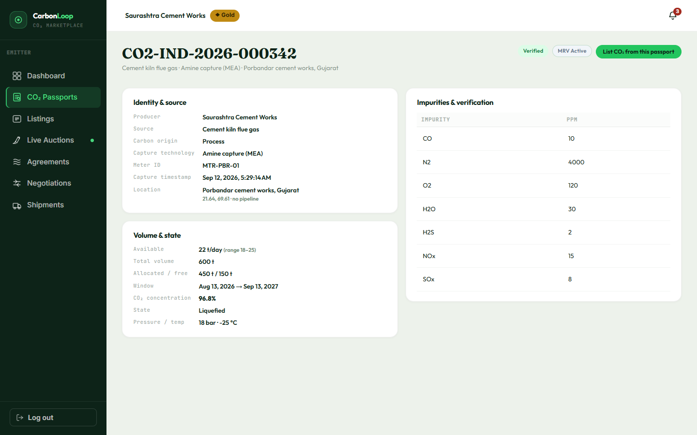<br/><b>CO₂ Passport</b><br/>Source, capture technology, impurities in ppm, meter ID, lab certification.</td>
<td width="50%">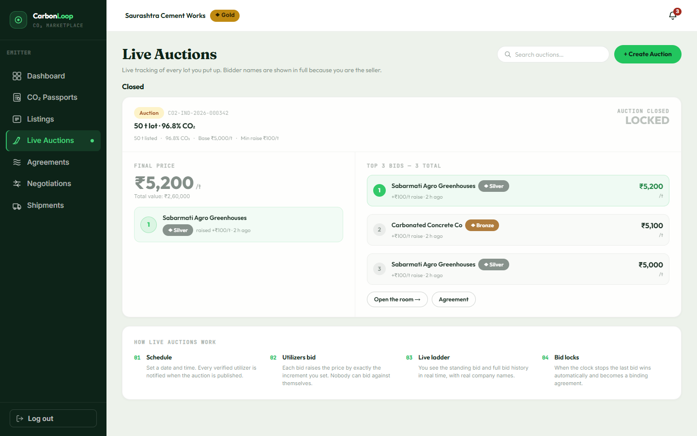<br/><b>Live auction</b><br/>Fixed increments, a ranked bid ladder, anti-sniping, last bid wins.</td>
</tr>
</table>

### 💡 The screen that makes the point

<div align="center">
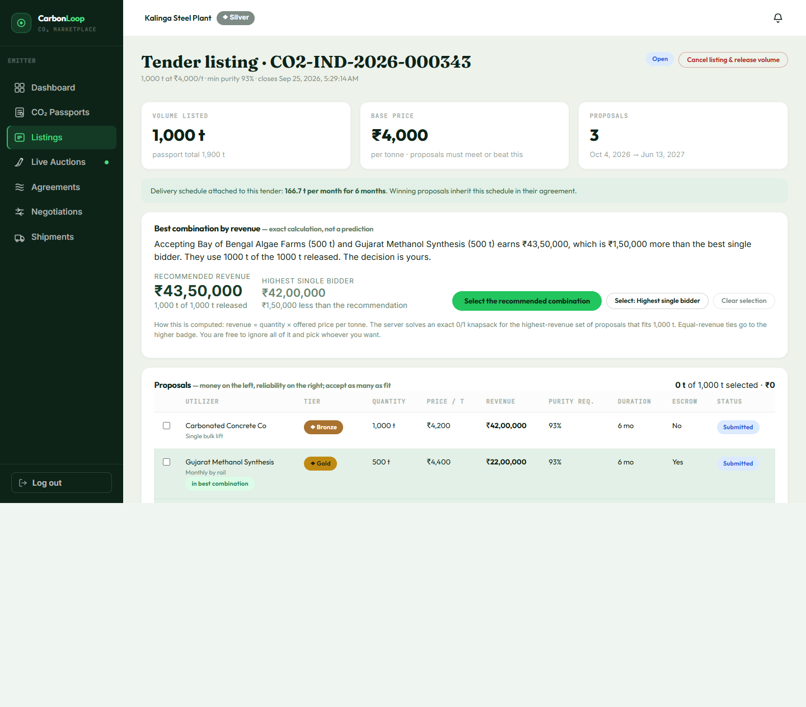
</div>

Three buyers want the same 1,000 tonnes. One offers to take the whole lot at ₹4,200/t. Two others want 500 tonnes each at higher prices. **The system solves it exactly** and tells the seller that splitting the award earns **₹43,50,000 against ₹42,00,000** — ₹1,50,000 more — then lets them ignore the advice entirely.

No model guessed that. It is an exact 0/1 knapsack over real offers, and the page explains the arithmetic in plain English.

<details>
<summary><b>More screens</b> — cost stack, transport, lab, regulator, audit</summary>
<br/>

| | |
|---|---|
| 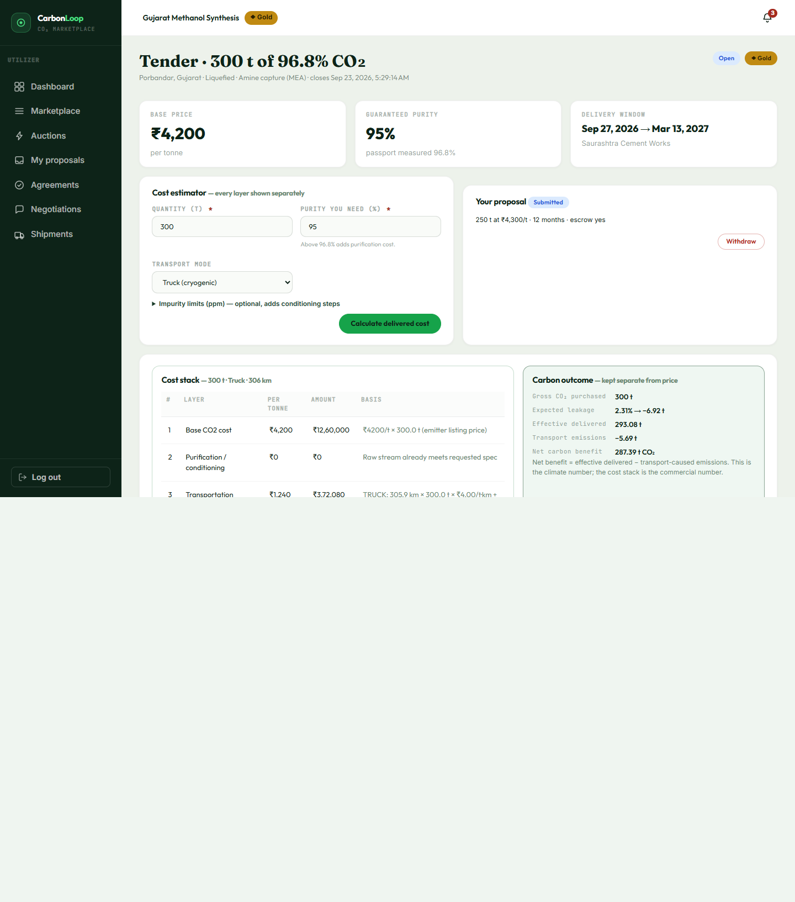 **Delivered cost, layer by layer** — gas, purification, transport, lab, platform. Net carbon benefit kept separate from money. | 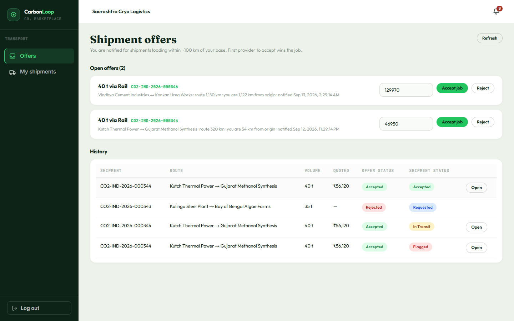 **Carrier portal** — jobs within 100 km, first to accept wins. |
| 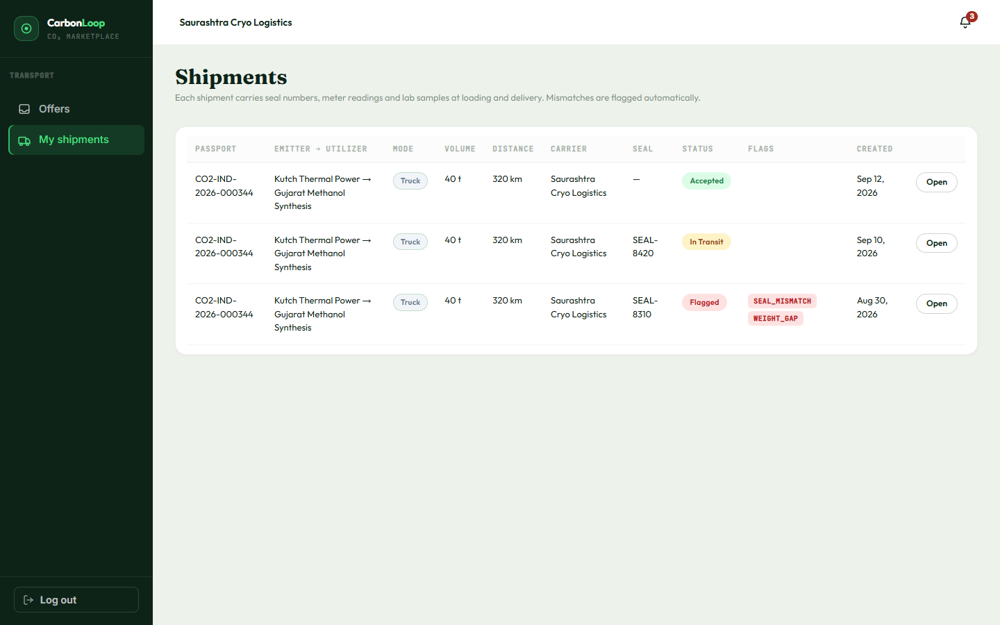 **Chain of custody** — seal numbers, meter readings and lab samples at both ends. | 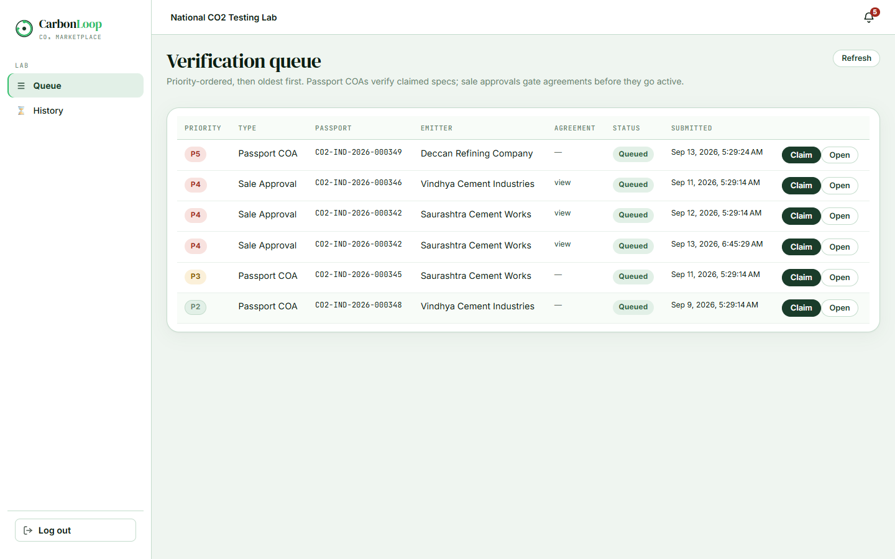 **Verification lab** — priority queue, claimed specs against measured. |
| 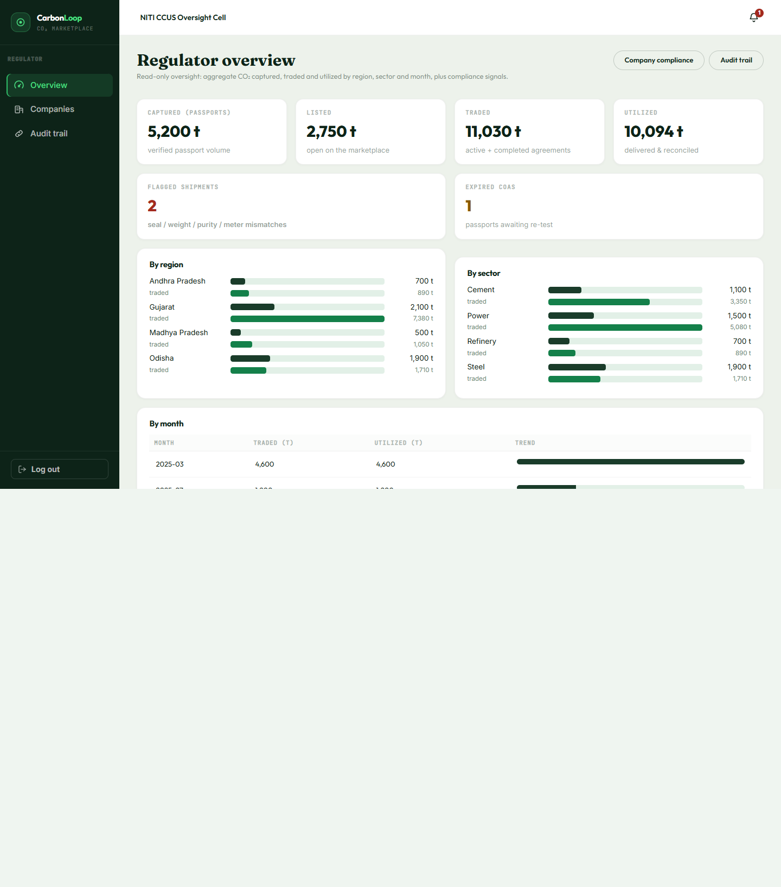 **Regulator oversight** — volumes by region, sector and month, plus compliance flags. | 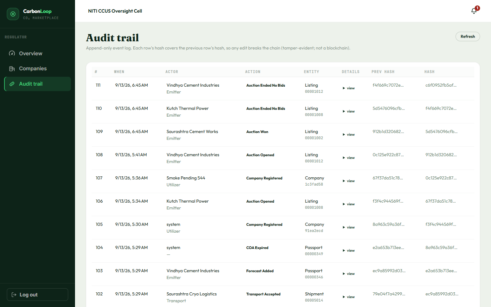 **Hash-chained audit trail** — every row's hash covers the previous one. |

</details>

---

## 🔄 How the loop works

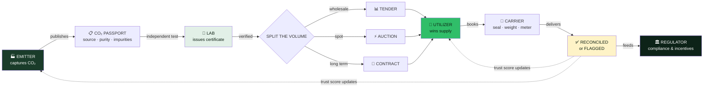

### The six roles

| Role | What they do |
|:--|:--|
| 🏭 **Emitter** | Publishes CO₂ Passports, splits volume across sale modes, picks buyers |
| 🌱 **Utilizer** | Browses verified supply, sees delivered cost before committing, bids or contracts |
| 🚛 **Transport** | Notified of jobs near its depots, quotes, records loading and delivery |
| 🔬 **Lab** | Works a priority queue, tests claimed against measured, issues or rejects certificates |
| 🏛 **Regulator** | Read-only oversight: volumes, compliance flags, incentive eligibility |
| 🛡 **Admin** | Verifies every company before it can transact |

---

## 🧩 Major modules

### 1️⃣ The CO₂ Passport
The core object. A specific, identifiable batch of gas.

Source, carbon origin, capture technology, daily tonnage, concentration, physical state, pressure and temperature, impurity levels in ppm for H₂O, O₂, NOₓ, SOₓ, H₂S, CO and N₂, meter ID, location, availability window and certificates. Extra attributes live in a **JSONB** column, so a stream can carry fields nobody anticipated.

> **Volume can never be sold twice.** Every allocation runs inside a transaction holding a row-level lock on the passport. Six concurrent requests for 100 t against 150 t of free stock produced exactly one success and five conflicts, with no overselling.

### 2️⃣ Three ways to trade

| Mode | Fits | Mechanism |
|:--|:--|:--|
| 📊 **Tender** | Plannable wholesale demand | Buyers propose, seller may accept **several at once**; the system finds the highest-earning combination |
| ⚡ **Auction** | Urgent spot lots | Scheduled, ascending, fixed increment, binding on the last bid, anti-sniping |
| 🤝 **Contract** | Multi-month certainty | Private offer/counter-offer thread with versions, take-or-pay, deposit, SLA gap threshold |

### 3️⃣ Delivered cost, layer by layer
Never one opaque number:

```
  Base CO₂ cost          ₹4,200/t × 100 t     = ₹4,20,000
+ Purification            3 conditioning steps = ₹  45,500
+ Transport               306 km by truck      = ₹1,27,360
+ Lab verification        flat per shipment    = ₹  12,000
+ Platform fee            0%                   = ₹       0
─────────────────────────────────────────────────────────
= TOTAL DELIVERED                              = ₹6,04,860
```

**Kept deliberately separate** because it is a climate number, not a price: expected leakage, effective delivered tonnes, transport emissions, and the **net carbon benefit**.

### 4️⃣ Anti-tampering chain of custody
A numbered seal goes on at loading with weight, meter reading and a lab sample. All four are checked again at delivery. Mismatches **flag automatically**: seal mismatch, weight gap beyond tolerance, purity drift, meter mismatch. Certificates expire and must be re-tested.

### 5️⃣ Trust, earned not claimed
Every company carries a badge. Emitters band on **tonnes actually sold**; utilizers on **completed agreements against cancellations**. Badges are visible; the arithmetic behind ranking is internal.

### 6️⃣ Oversight and audit
The regulator sees aggregate flows by region, sector and month, with compliance flags and eligibility for real schemes: **CCUS VGF 2026**, **NITI cluster pilots**, **CBAM export readiness**. Every state change is appended to a hash-chained audit log where each row's hash covers the previous one, so any edit breaks the chain. One database, no consensus, **not a blockchain**.

---

## 🚫 How the matching actually works

**No AI. No ML. No blockchain.** Every ranking, price and recommendation is arithmetic you can read.

- **Award optimisation** is an exact 0/1 knapsack over real offers. Ties break on badge, then reliability, then smaller volume, then who applied first.
- **Cost** is a published rate table, shown layer by layer with its basis.
- **Flags** come from comparing two measurements against a tolerance.
- **Incentive eligibility** is a documented rule, for example: sector ∈ {power, steel, cement, refinery, chemicals} **and** ≥1 verified passport **and** ≥1 live agreement.

Every formula, weight and rate lives in [`docs/DESIGN.md`](docs/DESIGN.md).

---

## 🚀 Run it

**Prerequisites:** Java 21, Node 20+, Docker Desktop.

```bash
# 1 · database
docker compose up -d

# 2 · backend  →  http://localhost:8080
cd backend && ./mvnw spring-boot:run

# 3 · frontend →  http://localhost:4200
cd frontend && npm install && npm start
```

Migrations apply and demo data seeds on first start. **No Docker?** Run the backend with `-Dspring-boot.run.profiles=h2` for an in-memory database with the same schema and seed.

<details>
<summary><b>Low-memory alternative</b> — about 320 MB instead of 2 GB</summary>

`ng serve` needs well over a gigabyte. Build once and serve the static output instead:

```bash
cd frontend && npm run build && cd ..
node scripts/serve-frontend.mjs          # same URL, same /api proxy

cd backend && ./mvnw -DskipTests package && cd ..
java -Xmx512m -jar backend/target/backend-0.0.1-SNAPSHOT.jar
```
Rebuild the frontend after editing its source; the static server does not watch files.
</details>

<details>
<summary><b>Deploying</b> — Railway and Vercel</summary>

**Backend + database on Railway.** Add a PostgreSQL service, deploy the repo with **Root Directory** set to `backend`, then set:

```
SPRING_DATASOURCE_URL=jdbc:postgresql://${{Postgres.PGHOST}}:${{Postgres.PGPORT}}/${{Postgres.PGDATABASE}}?stringtype=unspecified
SPRING_DATASOURCE_USERNAME=${{Postgres.PGUSER}}
SPRING_DATASOURCE_PASSWORD=${{Postgres.PGPASSWORD}}
APP_JWT_SECRET=<long random string>
APP_CORS_ORIGINS=https://your-app.vercel.app,https://*.vercel.app
```

`?stringtype=unspecified` is **not optional** — without it the JSONB columns fail to bind.

**Frontend on Vercel.** Import the repo with **Root Directory** set to `frontend`. `vercel.json` already forwards `/api` to the backend and sends client routes to `index.html`.
</details>

---

## 🔑 Demo accounts

Password for every account: **`Password123!`**

| Role | Email | Company |
|:--|:--|:--|
| 🛡 Admin | `admin@carbon.local` | Carbon Marketplace Admin |
| 🏭 Emitter | `cement@carbon.local` | Saurashtra Cement Works · Gujarat |
| 🏭 Emitter | `steel@carbon.local` | Kalinga Steel Plant · Odisha |
| 🏭 Emitter | `power@carbon.local` | Kutch Thermal Power · pipeline connected |
| 🏭 Emitter | `vindhya@carbon.local` | Vindhya Cement Industries · Madhya Pradesh |
| 🏭 Emitter | `deccanref@carbon.local` | Deccan Refining Company · Andhra Pradesh |
| 🌱 Utilizer | `methanol@carbon.local` | Gujarat Methanol Synthesis · Gold |
| 🌱 Utilizer | `algae@carbon.local` | Bay of Bengal Algae Farms · Diamond |
| 🌱 Utilizer | `greenhouse@carbon.local` | Sabarmati Agro Greenhouses · Silver |
| 🌱 Utilizer | `concrete@carbon.local` | Carbonated Concrete Co · Bronze |
| 🌱 Utilizer | `urea@carbon.local` | Konkan Urea Works · Maharashtra |
| 🚛 Transport | `gujtrans@carbon.local` | Saurashtra Cryo Logistics |
| 🚛 Transport | `odtrans@carbon.local` | East Coast Gas Carriers |
| 🔬 Lab | `lab@carbon.local` | National CO₂ Testing Lab |
| 🏛 Regulator | `regulator@carbon.local` | NITI CCUS Oversight Cell |

Sign-in also offers one-click demo accounts, so you never need to type these.

---

## 🎯 Ten-minute demo path

1. **Landing** — live impact counter, anonymised supply, how matching works.
2. **Admin** — approve a pending company; open the hash-chained audit log.
3. **Emitter (steel)** — open the 1,000 t tender. Three bidders; the system recommends splitting the award for ₹1,50,000 more. **Award it.**
4. **Lab** — the sale appears in the queue; approve it and watch the agreement activate.
5. **Utilizer (methanol)** — marketplace, then the cost estimator: watch purification and transport stack up, with net carbon benefit kept separate.
6. **Auction** — join a live lot, place a bid, see the ladder re-rank in real time.
7. **Transport** — accept a job, record loading with a seal number.
8. **Deliver with the wrong seal** — watch the shipment flag itself automatically.
9. **Regulator** — volumes by region and sector, compliance flags, incentive eligibility.

---

## 🧪 Testing

```bash
cd backend && ./mvnw test     # 54 tests
bash scripts/smoke.sh         # 29 end-to-end API checks
```

Covers the knapsack optimiser against worked examples, trust and badge banding, the full cost stack, reconciliation rules, auction settlement, the concurrency guard on volume allocation, and the audit chain's tamper detection.

---

## 🏗 Architecture

```
carbon-marketplace/
├── backend/                 Spring Boot API
│   └── com/carbonmarket/
│       ├── domain/          15 entities, 21 enums
│       ├── scoring/         ← all the arithmetic, pure and unit-tested
│       │   ├── TenderOptimizer      exact 0/1 knapsack
│       │   ├── CostCalculator       five-layer cost stack
│       │   ├── TrustScoring         badge banding
│       │   ├── ReconciliationRules  seal · weight · purity · meter
│       │   └── IncentiveRules       CCUS VGF · NITI · CBAM
│       ├── service/         business logic, row-level locking
│       ├── web/             11 REST controllers
│       └── seed/            deterministic demo data
├── frontend/                Angular 21, standalone + signals
│   └── src/app/
│       ├── core/            auth, API client, guards
│       ├── layout/          role-aware shell
│       └── pages/           six role portals
├── docs/DESIGN.md           every formula, entity and endpoint
└── scripts/smoke.sh         end-to-end API checks
```

**Stack:** Angular 21 · Spring Boot 3.5 · Java 21 · PostgreSQL 16 with JSONB · Flyway · JWT · Playwright for UI verification.

---

## 🗺 Roadmap

Jurisdiction policy engine · ERP and SCADA integration · insurance and incident workflow · environmental-attribute ownership ledger · government subsidy automation · storage and buffer fallback · dispute resolution · ESG certificate generator.

---

<div align="center">

**Built for Hackout '26 at DA-IICT**

Grounded in real policy: India's ₹20,000 crore CCUS allocation for 2026-27, NITI Aayog's cluster-hub model naming Gujarat and Odisha as pilots, and the EU's CBAM financial phase from 1 January 2026.

</div>
